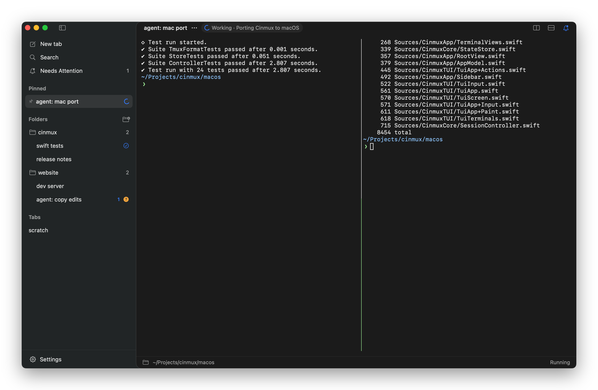
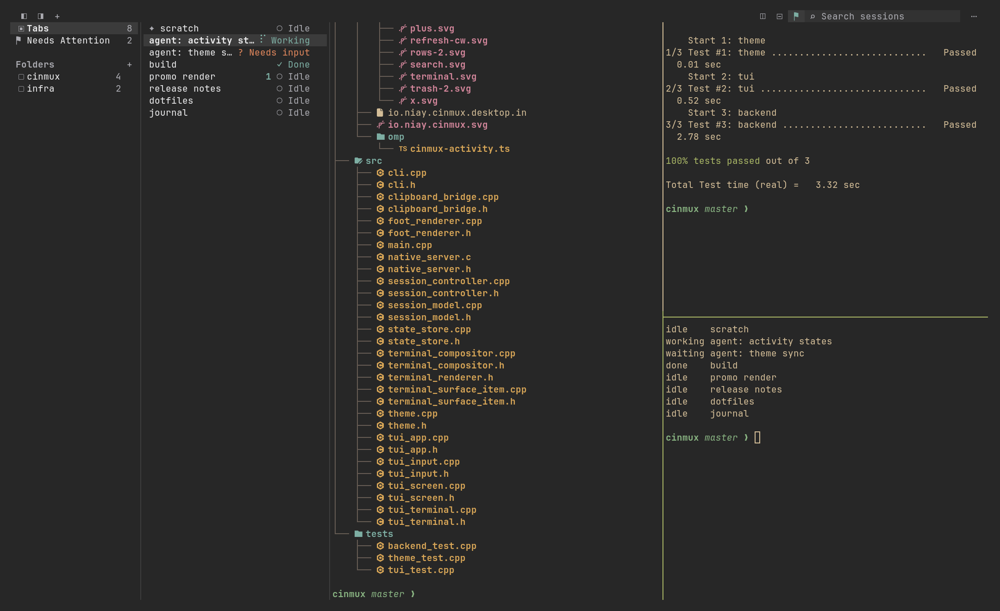

<h1 align="center">Cinmux</h1>

<p align="center">
  <b>Persistent terminal workspaces for Linux and macOS.</b><br>
  Real terminals in folders, agents you can read at a glance, and sessions that keep running — at your desk or over SSH.
</p>

<p align="center">
  <a href="#install">Install</a> · <a href="#macos">macOS</a> · <a href="#use-it-over-ssh">Over SSH</a> · <a href="#shortcuts">Shortcuts</a> · <a href="#agent-status">Agent status</a>
</p>


- **Organized.** Folders, pinned tabs, and search across titles, directories and git branches.
- **Persistent.** Every tab is a tmux session, so closing the app never stops your jobs.
- **Agent-aware.** Each tab shows *Working*, *Needs input* or *Done*, and anything waiting on you collects under **Needs Attention**.
- **Anywhere.** Native desktop apps for Linux and macOS, plus the same workspace in any terminal with `cinmux tui`.

## Install

On macOS 15 or later, with Homebrew:

```sh
brew install satellitedown/cinmux/cinmux
```

Or with the installer, on macOS, Arch Linux or Omarchy:

```sh
curl -fsSL https://raw.githubusercontent.com/satellitedown/cinmux/master/install.sh | bash
```

The installer adds anything missing, builds the latest version, installs it to `~/.local` (on macOS, `Cinmux.app` goes in `~/Applications`), and hooks up [OMP](#agent-status) if you use it. Run it again to update; your sessions keep running.

<sub>Options: `CINMUX_PREFIX` (install location), `CINMUX_APP_DIR` (where `Cinmux.app` goes), `CINMUX_REF` (branch or tag), `CINMUX_NO_OMP=1` (skip OMP).</sub>

## macOS



A native Mac app with the same sessions, folders, agent statuses, CLI and `cinmux tui`. It follows your light or dark mode, shows Nerd Font prompt icons out of the box, and sends a notification when a tab needs you. Homebrew puts the app in `$(brew --prefix)/opt/cinmux`; `cinmux` opens it from any terminal.

## Use it over SSH



`cinmux tui` puts the whole workspace in a terminal, so you can pick up your sessions from any computer that can SSH in:

```sh
ssh -t you@your-machine cinmux tui
```

- **Nothing to install** on the other computer. Any terminal with SSH works.
- **Same workspace.** Tabs, folders, menus and statuses, live alongside the desktop app.
- **Mouse works.** Click, right-click for menus, drag tabs onto folders, resize the columns.
- **Disconnecting is safe.** Quitting or dropping the connection leaves every session running.

Ghostty, kitty, foot and Alacritty get the same shortcuts as the desktop app. Other terminals use `Ctrl+Alt` in place of `Ctrl+Shift` (`Ctrl+Alt+T` for a new tab). If colors look flat, set `CINMUX_TUI_COLORS=24bit`. If the remote shell can't find `cinmux`, run `'~/.local/bin/cinmux tui'` instead (a Homebrew install on a Mac: `/opt/homebrew/bin/cinmux tui`).

## Shortcuts

| Linux | macOS | Action |
| --- | --- | --- |
| `Ctrl+Shift+N` | `⌘T` | New tab |
| `Ctrl+Alt+N` | `⇧⌘N` | New folder |
| `Ctrl+Shift+F` | `⌘F` | Search |
| `Ctrl+R` | `⌘R` | Rename tab |
| `Ctrl+Shift+W` | `⇧⌘W` | Close tab |
| `Ctrl+Alt+PageUp` / `PageDown` | `⇧⌘[` / `⇧⌘]` | Previous / next tab |
| `Ctrl+Alt+U` | `⌘J` | Jump to the tab that needs you |
| `Ctrl+Shift+B` / `Ctrl+Shift+L` | `⌃⌘S` | Show or hide the sidebar |
| | `⌘D` / `⇧⌘D` | Split right / down |
| `Ctrl+Shift+Q` | `⌘Q` | Quit (sessions keep running) |

Inside a tab, `Alt+Enter` splits down, `Alt+Shift+Enter` splits right, `Ctrl+Alt+Arrow` moves between panes and `Ctrl+Alt+Shift+Arrow` resizes them (Option is Alt on a Mac). The tmux prefix is `Ctrl+Space` or `Ctrl+B`.

In the TUI, `Ctrl+Shift+E` jumps to the tab list. Outside the terminal, Tab moves between search, folders, tabs and the terminal.

## Agent status

Every tab shows what its agent is doing — **Working**, **Needs input**, **Done** or **Idle** — and tabs waiting on you appear under **Needs Attention**.

OMP reports this through the bundled extension, which the installer links for you. To link it yourself:

```sh
mkdir -p ~/.omp/agent/extensions
ln -s ~/.local/share/cinmux/omp/cinmux-activity.ts ~/.omp/agent/extensions/   # macOS: Cinmux.app/Contents/Resources/omp/cinmux-activity.ts
```

Anything else can use the CLI. `activity` and `notify` target the tab they run in; from elsewhere, add `--session <id>` (see `cinmux list --json`).

```sh
cinmux activity --state working --pid "$$" --detail 'Running checks'   # PID of the long-running process
cinmux notify --title 'Build complete' --body 'Ready to review'
cinmux list --json
```

## Good to know

- **Closing the app keeps sessions running; closing a tab ends its shells.** Sessions don't survive a reboot, but your tabs do — start them again with one click.
- **Theme:** on Linux, follows your Omarchy theme (set `CINMUX_THEME_DIR` to use another theme folder); on macOS, follows light and dark mode.
- **Profiles:** set `CINMUX_STATE_DIR` to an absolute path for a separate set of tabs.
- **Isolation:** Cinmux runs its own private tmux server and never edits your tmux, Foot or Hyprland config.

## Build from source

**Linux:** you'll need CMake 3.25+, Ninja, a C++20 compiler, Qt 6.8+, wlroots 0.20, libvterm 0.3+, toml++, ICU, pixman and xkbcommon, plus Foot, tmux and git at runtime. On Arch or Omarchy:

```sh
sudo pacman -S --needed gcc cmake ninja pkgconf qt6-base qt6-declarative qt6-wayland qt6-svg icu tomlplusplus wlroots0.20 wayland libxkbcommon pixman libvterm foot tmux git noto-fonts xdg-utils
git clone https://github.com/satellitedown/cinmux.git && cd cinmux
cmake -S . -B build -G Ninja -DCMAKE_BUILD_TYPE=Release -DCMAKE_INSTALL_PREFIX="$HOME/.local"
cmake --build build && cmake --install build
```

The desktop app needs a Wayland session; `cinmux tui` doesn't.

**macOS:** you'll need macOS 15+, the Xcode Command Line Tools (Swift 6) and tmux. `macos/scripts/build-app.sh` builds `macos/build/Cinmux.app`; `swift test --package-path macos` runs the tests.

## License

MIT. The look is based on Niay Notes, the Linux interface icons come from [Lucide](resources/icons/LICENSE), and the Mac app draws with [SwiftTerm](https://github.com/migueldeicaza/SwiftTerm) and bundles the [Nerd Fonts](macos/Resources/SymbolsNerdFont-LICENSE) symbols.
