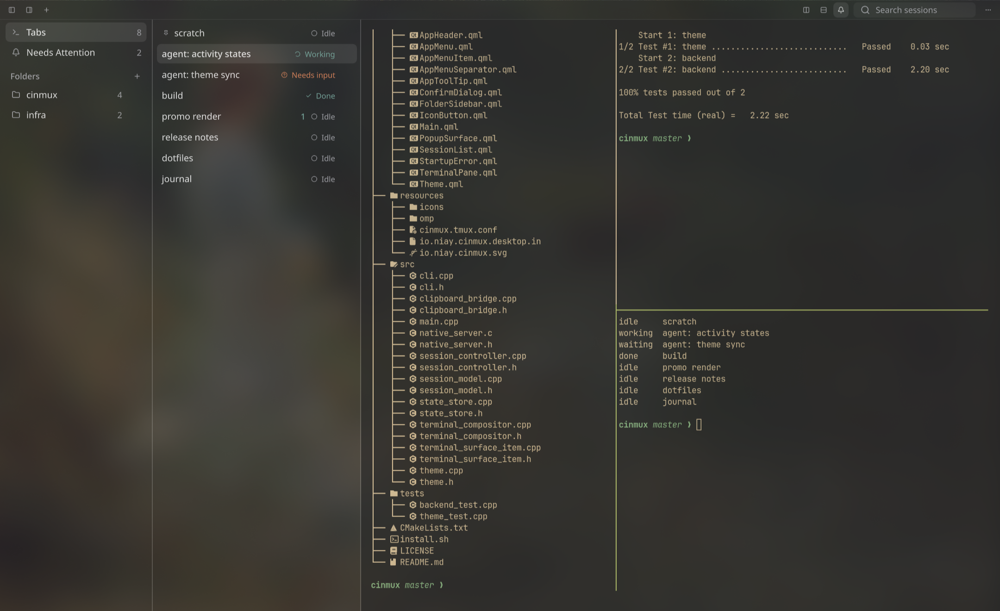

# Cinmux



Persistent terminal workspaces for a Linux Wayland desktop. Organize real terminal sessions in a Notes-style native interface: folders, pinned entries, global search, tmux splits, working-directory/git metadata, and durable attention notifications.

Cinmux uses Qt Quick for the application chrome and an in-process **wlroots/pixman compositor displaying real Foot clients** for terminals. It is not Electron, a browser terminal emulator, or a scheme for positioning external terminal windows. Each entry owns a tmux session; tmux manages its panes and windows.

## Install

On Arch Linux or Omarchy, one command installs Cinmux:

```sh
curl -fsSL https://raw.githubusercontent.com/satellitedown/cinmux/master/install.sh | bash
```

The [installer](install.sh) does the following:

- installs any missing packages from the list below, using `omarchy pkg add` on Omarchy or `sudo pacman -S --needed` otherwise;
- builds the latest source;
- installs to `~/.local`;
- enables the [OMP integration](#enable-the-omp-integration) if OMP is set up.

Run the same command again to update. Running terminal sessions survive; reopen the window to get the new version. Set `CINMUX_PREFIX` for a different install prefix, `CINMUX_REF` for a branch or tag, or `CINMUX_NO_OMP=1` to skip the OMP step.

For other distributions, install the [dependencies](#dependencies) and [build manually](#build-and-install).

## Dependencies

Use normal distribution packages. No patched Qt, patched Foot, custom dependency forks, or Qt Wayland Compositor module is required.

Build requirements, matching `CMakeLists.txt`:

- C11 and C++20 compilers, CMake **3.25+**, Ninja, and pkg-config.
- Qt **6.8+**: Core, Gui, Qml, Quick, QuickControls2, QuickDialogs2, Sql, Network, and Svg; Qt Test when `BUILD_TESTING=ON`.
- toml++ (`tomlplusplus` CMake package) and ICU's `uc` library.
- **wlroots 0.20.2 or newer within the 0.20 ABI series**: pkg-config module `wlroots-0.20`, constrained to `>=0.20.2` and `<0.21`. Other wlroots ABI series are not interchangeable; installing only a newer differently named series does not satisfy this requirement.
- pkg-config modules `wayland-server`, `wayland-client`, `xkbcommon`, and `pixman-1`.

Runtime requirements:

- A Linux Wayland desktop and an existing, user-owned `XDG_RUNTIME_DIR`. The GUI is Wayland-only, not an X11 application.
- Foot, tmux, and git on `PATH`; git supplies branch metadata.
- Qt Quick Controls Basic, the Qt SQLite SQL driver, the Qt Wayland platform plugin, and Qt SVG image support. Distribution splits vary: installing only the Qt development headers is not enough.
- Noto Sans for the intended interface typography (otherwise the system sans-serif fallback is used).
- `xdg-open` for opening terminal URLs in host applications.

### Arch Linux / Omarchy

Install only missing named packages from your configured repositories. On Omarchy:

```sh
omarchy pkg add gcc cmake ninja pkgconf qt6-base qt6-declarative qt6-wayland qt6-svg icu tomlplusplus wlroots0.20 wayland libxkbcommon pixman foot tmux git noto-fonts xdg-utils
```

On plain Arch Linux, the corresponding command is:

```sh
sudo pacman -S --needed gcc cmake ninja pkgconf qt6-base qt6-declarative qt6-wayland qt6-svg icu tomlplusplus wlroots0.20 wayland libxkbcommon pixman foot tmux git noto-fonts xdg-utils
```

These commands do not request a system-wide update. Do not force incompatible versions or use a partial repository refresh to bypass package-manager dependency errors. If your repositories do not provide the supported wlroots ABI, that is an unmet build prerequisite, not a reason to patch Qt or Foot.

For other distributions, use packages providing the libraries/modules above, including their development headers and Qt runtime plugins. Package names differ; no non-Arch package recipe is implied here.

## Build and install

Clone the repository and run these commands from its root:

```sh
git clone https://github.com/satellitedown/cinmux.git && cd cinmux
```

```sh
cmake -S . -B build -G Ninja \
  -DCMAKE_BUILD_TYPE=Release \
  -DCMAKE_INSTALL_PREFIX="$HOME/.local" \
  -DBUILD_TESTING=ON
cmake --build build
ctest --test-dir build --output-on-failure
cmake --install build
```

Configure the prefix **before building**: the desktop launcher's `Exec` path is generated from that configured prefix. To change the destination later, reconfigure and rebuild rather than only passing a different `--prefix` to `cmake --install`. No `sudo` is needed for the user prefix. Tests are not a substitute for checking native input, clipboard, and rendering in a live Wayland session.

Run the uninstalled application with `./build/cinmux`, or after installation:

```sh
"$HOME/.local/bin/cinmux"
```

The desktop launcher is **Cinmux**, with application identity `io.niay.cinmux`. Installation places the executable in `bin/`, the desktop entry in `share/applications/`, and the application icon in `share/icons/hicolor/scalable/apps/` below the prefix. Add `$HOME/.local/bin` to your shell's `PATH` if it is not already there to invoke `cinmux` by name outside the app. Desktop menu discovery follows your desktop's normal XDG data paths.

QML, interface icons, and the app-owned tmux configuration are embedded in the binary. The installed application does not depend on the build working directory, a sibling Niay Notes checkout, or `node_modules`. Shared libraries, Qt plugins, Foot, tmux, and git remain runtime dependencies.

Cinmux prefixes its executable directory to the session's `PATH`, but login files or environment managers can replace that path during shell startup. Installation is recommended for normal use. Before installation, use the absolute `build/cinmux` path for notifications if your shell removes the development directory. Cinmux does not inject shell hooks or modify your shell configuration to override it.

## Sessions and controls

- **New tab** creates an independent terminal, using the selected folder and the active pane's directory (home when no session is selected).
- Rename the selected session with **Ctrl+R**, or choose **Rename** from its right-click menu, to edit the title directly in place. Enter saves and returns to the terminal; Escape cancels. The row stays the same height and keeps its status visible while editing. Right-click also offers pinning and moving. Drag a session onto a folder, or onto **Tabs** to unfile it. Folders are labels, not filesystem directories; deleting a folder does not close its sessions.
- Search is global across folders and matches titles, directories, and git branches—not terminal transcripts. Filtering and switching do not stop jobs or discard splits.
- **Split right / Split down** creates tmux panes. Hover a session row for its active-pane directory, branch, status, and notification details. Stopped sessions have an explicit **Start session** action; a failed terminal view offers **Reconnect terminal** without restarting its running jobs.
- **Needs Attention** shows unread notifications and agents waiting for input/permission. Selecting an entry acknowledges the notifications already observed, but does not clear a pending question; incoming messages are not automatically read merely because their terminal is selected.
- Folder and session panes can be hidden or resized. Narrow windows show at most one side pane; returning to a wide window restores the wide-layout choices.
- The toolbar is 28px high; normal session rows are 30px, with no redundant all-tabs heading or terminal title/directory banner. Hover or keyboard-focus a row to reveal its trash button. It confirms closure of that row's session, even when another session is selected.
- Session, folder, and toolbar menus share grouped icon actions, shortcut hints, and separate destructive actions. **Move to folder** marks the current destination. Use a folder's hover **…** button or right-click to rename/delete it. A focused session/folder also opens its menu with **Shift+F10** or the Menu key; arrow keys navigate, Enter activates, and Escape dismisses.
- Right-click empty space in either sidebar for **New tab**, **New folder**, or **Show all tabs**. Folder and session menus also offer **New tab**, created in that item's folder.

### Keyboard shortcuts

Application shortcuts deliberately avoid plain `Ctrl+N` and `Ctrl+Q`, which belong to terminal applications. `Ctrl+R` is reserved for renaming the selected session, replacing the shell's usual reverse-history shortcut inside Cinmux.

| Shortcut | Action |
| --- | --- |
| `Ctrl+Shift+N` | New session |
| `Ctrl+Alt+N` | New folder |
| `Ctrl+Shift+F` | Focus session search |
| `Ctrl+Shift+B` | Toggle folders |
| `Ctrl+Shift+L` | Toggle session list |
| `Ctrl+R` | Rename selected session |
| `Ctrl+Shift+W` | Confirm close session |
| `Ctrl+Alt+PageUp` / `Ctrl+Alt+PageDown` | Previous / next visible session |
| `Ctrl+Alt+U` | Select newest unread session |
| `Ctrl+Shift+Q` | Quit GUI, keeping sessions alive |

When the session list has focus, Up/Down selects entries and Enter focuses the terminal. Escape dismisses a Qt overlay or leaves search; otherwise it belongs to the terminal. Ordinary `Ctrl+C/D/Z`, tmux prefixes `Ctrl+Space` / `Ctrl+B`, and Foot's copy/paste/search/zoom shortcuts remain terminal input.

The private tmux configuration includes `Alt+Enter` to split down, `Alt+Shift+Enter` to split right, `Ctrl+Alt+Arrow` to focus panes, and `Ctrl+Alt+Shift+Arrow` to resize them. Pane/window termination shortcuts prompt before killing jobs.

### What persists

Closing the window or quitting Cinmux closes its Foot views, **not its tmux jobs**. Reopening the same profile reconnects to surviving sessions, preserving their processes, directories, and splits. The row's trash button, **Ctrl+Shift+W**, and the context menu all confirm **Close session**, which terminates that exact session's shells/jobs and removes its entry. The dialog initially focuses Cancel; Tab to Close session and press Enter to confirm with the keyboard. **Close pane** also confirms termination. This is not a trash/recovery operation.

Processes are not restored after a reboot; logout may also end them according to the system's session policy. Saved entries remain and can be started explicitly, but commands are not replayed and terminal transcripts are not saved by Cinmux.

## Tab activity and OMP

Every tab row keeps an activity icon and label visible, including when another tab is selected:

- **Idle** — no integrated agent is reporting active work.
- **Working** — OMP is running a turn, tool, or background job; the icon spins.
- **Needs input** — OMP is waiting for an answer or tool permission. Hover the row for the question or permission detail.
- **Done** — OMP finished its turn successfully. This stays visible until new work, an idle/reset event, or the reporting process exits.

Activity is separate from a terminal's running/stopped status. Cinmux does not guess agent progress from output, CPU use, or the presence of a shell. Unintegrated programs do not automatically report activity. Interrupted/error turns return to Idle rather than claiming successful completion.

Waiting tabs also appear in **Needs Attention**, even after their notifications are acknowledged. Selecting a tab does not answer or clear its pending question. Multiple reporters in a tab's splits aggregate as **Needs input → Working → Done → Idle**; one idle/completed reporter cannot hide another's active work. Reports survive GUI closure, but dead reporters and reused PIDs are discarded using Linux process start identity and boot identity.

### Enable the OMP integration

The install includes `share/cinmux/omp/cinmux-activity.ts`. The one-line installer links it automatically when `~/.omp/agent` (or `PI_CODING_AGENT_DIR`) exists. To link it by hand for a normal user-prefix installation and the default OMP profile:

```sh
mkdir -p "$HOME/.omp/agent/extensions"
ln -s "$HOME/.local/share/cinmux/omp/cinmux-activity.ts" \
  "$HOME/.omp/agent/extensions/cinmux-activity.ts"
```

For named OMP profiles or `PI_CODING_AGENT_DIR`, use that profile's extension directory instead. Alternatively, load it for one launch with `omp -e "$HOME/.local/share/cinmux/omp/cinmux-activity.ts"`.

Start a new OMP process to load the extension; already-running OMP instances are not modified automatically. It is inactive outside Cinmux and in headless/subagent contexts; it only observes interactive OMP lifecycle, question, approval, and background-job events. It does not approve commands, change tools, or edit OMP settings. The event integration was verified with OMP 18.2.11. `CINMUX_EXECUTABLE` can override the `cinmux` executable used by the extension, for example for a development build.

Other integrations can report through the same headless CLI:

```sh
cinmux activity --state working --pid "$$" --detail 'Running checks'
cinmux activity --state waiting --pid "$$" --detail 'Choose a deployment target'
cinmux activity --state done --pid "$$" --detail 'Checks complete'
cinmux activity --state idle --pid "$$"
```

Use the reporting process's PID, not the short-lived CLI process's PID. `--session UUID` overrides `CINMUX_SESSION_ID`; use the target profile's `CINMUX_STATE_DIR`. Detail is plain text, limited to 1024 characters. Idle removes only that reporter's state.

## Notifications and CLI

Inside a Cinmux terminal, the owning session/profile environment is supplied automatically:

```sh
cinmux notify --title 'Needs input' --body 'Choose a branch'
cinmux list --json
```

From another terminal—even while the GUI is closed—use a session UUID returned by `list`:

```sh
cinmux list --json
cinmux notify --session "$SESSION_ID" --title 'Build complete' --body 'Ready to review'
```

Set `SESSION_ID` to the intended entry's lowercase UUID. `--session` takes precedence over `CINMUX_SESSION_ID`; notifications never guess a target from the GUI selection. Use the same `CINMUX_STATE_DIR` as the target profile when it is overridden. Titles and bodies are plain text.

`list --json` returns objects with `id`, `title`, `folderId` (string or null), `cwd`, current `status` (`running` or `stopped`), `unreadCount`, `activity` (`idle`, `working`, `waiting`, or `done`), and `activityDetail`. It queries the private tmux server without starting missing sessions. `notify` and `activity` exit 0 on success, 2 for invalid arguments/unknown sessions, and 1 for storage/runtime errors. `cinmux --help` and `cinmux --version` are also available without a GUI.

Foot's OSC notifications route to the same entry while its renderer exists; tmux applications may need DCS passthrough. Use the CLI for reliable notification delivery when the GUI or renderer is closed. OSC notifications are separate from the explicit activity-reporting integration above.

## Profiles, appearance, and isolation

By default, persistent state lives in `$XDG_DATA_HOME/cinmux` (or `$HOME/.local/share/cinmux`): `state.sqlite` stores entries/folders/notifications/activity reports and `ui.ini` stores GUI preferences. Schema upgrades preserve existing data. Each canonical state directory identifies a separate profile, with one GUI owner and private runtime sockets under `$XDG_RUNTIME_DIR`. Its tmux server uses `$XDG_RUNTIME_DIR/cinmux-<profileHash>/tmux.sock`, not the user's default tmux socket. Foot connects to a separate private nested Wayland socket; terminal jobs retain the host desktop environment.

For a separate profile without touching the normal collection:

```sh
CINMUX_STATE_DIR="$HOME/.local/share/cinmux-sandbox" ./build/cinmux
CINMUX_STATE_DIR="$HOME/.local/share/cinmux-sandbox" ./build/cinmux list --json
```

`CINMUX_STATE_DIR` must be absolute. Do not override `XDG_RUNTIME_DIR` or the host `WAYLAND_DISPLAY` just to select a profile. A valid runtime directory is still needed for private-server operations, including CLI status queries.

The interface follows the published Omarchy theme at `$XDG_STATE_HOME/omarchy/current/theme` (default `$HOME/.local/state/omarchy/current/theme`), keeping the last valid palette through incomplete theme changes. Without a valid theme it uses the built-in charcoal/lime palette. An absolute `CINMUX_THEME_DIR` selects a different theme directory containing `colors.toml` and, optionally, the `light.mode` marker:

```sh
CINMUX_STATE_DIR="$HOME/.local/share/cinmux-sandbox" \
CINMUX_THEME_DIR="$HOME/my-cinmux-theme" ./build/cinmux
```

Foot inherits the user's terminal appearance/configuration, with app-specific per-process overrides for embedding, explicit attachment, notifications, and host URL opening. Existing Foot views keep the appearance they loaded; new or explicitly reconnected views pick up updated settings. Theme changes do not restart jobs. Regular host clipboard copy/paste is bridged; desktop **PRIMARY selection is not supported**.

The toolbar and both navigation columns share the terminal theme's base background color, with translucency only on the chrome; their text and controls remain fully opaque. Terminal content stays opaque for readability. This uses the application's alpha surface, without changing desktop opacity rules or the user's Foot configuration.

Cinmux does not edit the user's Foot/tmux configuration, Hyprland rules/keybindings, default terminal association, Omarchy files, or Niay Notes data. Its private tmux server uses the embedded app configuration rather than sourcing the user's tmux configuration.

## Attribution

Cinmux is released under the [MIT License](LICENSE). The visual shell and palette are based on Niay Notes. Copied Lucide icon geometry and its upstream Lucide ISC / Feather MIT notices are in [`resources/icons/LICENSE`](resources/icons/LICENSE). Dependency and asset licenses apply independently.
